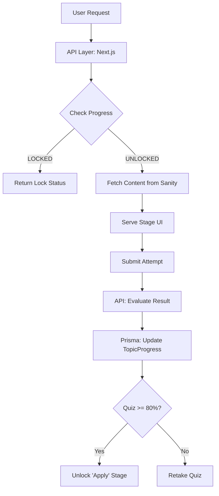

# Phase 01: State Machine & Schema Engine - Research

**Researched:** 2026-04-18
**Domain:** Learning Engine Architecture / Database Schema
**Confidence:** HIGH

## Summary

This research phase defines the technical foundation for the ML Cognitive Coach learning engine. The system pivots from a passive reader to an active, gated learning experience. The core of this transition is a Prisma-managed state machine that tracks user progress through a 3-tier hierarchy (Phase -> Module -> Topic) and enforces sequential stage unlocking (Understand -> Reinforce -> Test -> Apply).

Key technical decisions include leveraging Prisma 7's new support for SQLite Enums to provide type safety for the state machine, implementing an 80% mastery gate for quiz completion, and defining an aggregate mastery schema for Math, Coding, and Concept domains.

**Primary recommendation:** Implement a strict sequential unlocking logic in the `TopicProgress` model using a `highestStage` Enum, backed by `QuizAttempt` records to verify the 80% mastery gate before unlocking the 'Apply' stage.

## Architectural Responsibility Map

| Capability | Primary Tier | Secondary Tier | Rationale |
|------------|-------------|----------------|-----------|
| Content Hierarchy | CMS (Sanity) | API (Next.js) | Sanity owns the canonical structure and rich content blocks. |
| Progression State | DB (Prisma) | API (Next.js) | Database stores the ground truth of user status and stage locks. |
| Mastery Enforcement| API (Next.js) | DB (Prisma) | Server-side logic verifies quiz scores against gates before updating DB state. |
| Aggregate Mastery | API (Next.js) | DB (Prisma) | Calculation of domain mastery (Math/Coding) is performed by API during state transitions. |
| User Identity | DB (Prisma) | NextAuth | Standard NextAuth integration with Prisma adapter. |

## Standard Stack

### Core
| Library | Version | Purpose | Why Standard |
|---------|---------|---------|--------------|
| Prisma | 7.7.0 [VERIFIED] | ORM & Type Safety | Supports Enums in SQLite (Prisma 6.2+); provides superior DX for relational modeling. |
| better-sqlite3 | 12.9.0 [VERIFIED] | DB Driver | High-performance SQLite driver for Node.js, required by Prisma adapter. |
| NextAuth | 4.24.14 [VERIFIED] | Authentication | Standard auth solution for Next.js, integrates seamlessly with Prisma. |

### Supporting
| Library | Version | Purpose | When to Use |
|---------|---------|---------|--------------|
| Vitest | Latest | Testing | Unit and integration testing for schema and logic. |
| Zod | ^3.23.0 [ASSUMED] | Validation | Use for validating incoming attempt data and enforcing schema constraints in the API. |

**Installation:**
```bash
# Core dependencies already installed in package.json
npm install @prisma/client@7.7.0
npm install -D vitest
```

## Architecture Patterns

### System Architecture Diagram
The learning engine operates as a state-aware middleware between Sanity content and the User UI.



### Recommended Project Structure
```
src/
├── app/
│   └── api/
│       ├── progress/    # Unlocking & State logic
│       ├── attempts/    # Quiz/Practice submission
│       └── mastery/     # User metrics dashboard
├── lib/
│   └── learning-engine/ # State machine transition logic (Pure functions)
├── prisma/
│   └── schema.prisma    # The source of truth for progression
└── tests/
    ├── schema.test.ts   # Integration tests for Prisma schema
    └── engine.test.ts   # Unit tests for state machine logic
```

### Pattern 1: Sequential Stage Marker
**What:** Instead of boolean flags for each stage, use a single `highestStage` Enum.
**When to use:** When stages must be completed in a strict linear order.
**Example:**
```typescript
// Unlocking logic
function canAccessStage(currentHighest: StageType, requested: StageType): boolean {
  const stages = Object.values(StageType);
  return stages.indexOf(requested) <= stages.indexOf(currentHighest);
}
```

### Anti-Patterns to Avoid
- **Client-Side State Trust:** Never trust the browser to "tell" the server that a quiz was passed. The server must re-verify the score in `QuizAttempt` before updating `TopicProgress`.
- **Sanity ID Mismatch:** Ensure Prisma `Topic` IDs are stable and ideally match or map 1:1 with Sanity document IDs to prevent synchronization drift.

## Don't Hand-Roll

| Problem | Don't Build | Use Instead | Why |
|---------|-------------|-------------|-----|
| CUID Generation | Custom random strings | Prisma `@default(cuid())` | Collision resistance and DB optimization. |
| State Validation | Switch/Case logic | Zod / Prisma Enums | Built-in type safety and runtime validation. |
| DB Migrations | Manual SQL scripts | Prisma Migrate | Version-controlled, safe schema updates for SQLite. |

## Common Pitfalls

### Pitfall 1: SQLite Enum Sync
**What goes wrong:** Adding an Enum value in Prisma but SQLite (via direct access) allows any text.
**Why it happens:** SQLite treats Enum columns as `TEXT`.
**How to avoid:** Always use the Prisma Client for updates; add Zod validation on API routes.

### Pitfall 2: Atomic Mastery Updates
**What goes wrong:** Mastery scores drift from attempt history.
**Why it happens:** Updating mastery as a separate non-transactional call.
**How to avoid:** Use `prisma.$transaction` when recording a passing quiz and updating `UserMastery`.

## Code Examples

### Verified Prisma 7 SQLite Enum Pattern
```prisma
// Source: https://www.prisma.io/docs/orm/overview/databases/sqlite#enums
enum StageType {
  UNDERSTAND
  REINFORCE
  TEST
  APPLY
}

model TopicProgress {
  id           String    @id @default(cuid())
  userId       String
  topicId      String
  highestStage StageType @default(UNDERSTAND)
  completedAt  DateTime?

  @@unique([userId, topicId])
}
```

## State of the Art

| Old Approach | Current Approach | When Changed | Impact |
|--------------|------------------|--------------|--------|
| `Progress` model with 1-tier | `Phase/Module/Topic` 3-tier | Phase 1 (Project Pivot) | Supports complex, gated learning paths. |
| Boolean flags for stages | `highestStage` Enum | Prisma 7 | Cleaner schema, native-like type safety in SQLite. |
| Manual Mastery Tracking | Structured `UserMastery` model | Phase 1 | Enables data-driven dashboard metrics. |

## Assumptions Log

| # | Claim | Section | Risk if Wrong |
|---|-------|---------|---------------|
| A1 | Sanity IDs will map 1:1 to Prisma Topic IDs | Architecture | Low - Mapping table can be used if IDs differ. |
| A2 | SQLite Enum polyfill works as advertised in v7 | Code Examples | Low - Fallback to String with `@check` is possible. |

## Environment Availability

| Dependency | Required By | Available | Version | Fallback |
|------------|------------|-----------|---------|----------|
| Node.js | Runtime | ✓ | 22.20.0 | — |
| Prisma | Data Layer | ✓ | 7.7.0 | — |
| better-sqlite3 | Driver | ✓ | 12.9.0 | — |
| SQLite | Storage | ✓ | dev.db exists | — |
| Vitest | Testing | ✓ | Latest | — |

## Validation Architecture

### Test Framework
| Property | Value |
|----------|-------|
| Framework | Vitest |
| Config file | `vitest.config.ts` |
| Quick run command | `npx vitest` |
| Full suite command | `npx vitest --run` |

### Phase Requirements → Test Map
| Req ID | Behavior | Test Type | Automated Command | File Exists? |
|--------|----------|-----------|-------------------|-------------|
| STATE-01| Hierarchy Relations | Integration | `npx vitest tests/schema.test.ts` | ❌ Wave 0 |
| STATE-02| Stage Lock Logic | Unit | `npx vitest tests/engine.test.ts` | ❌ Wave 0 |
| STATE-03| 80% Gate Enforcement | Unit | `npx vitest tests/engine.test.ts` | ❌ Wave 0 |

### Wave 0 Gaps
- [ ] `vitest.config.ts` — Framework setup.
- [ ] `tests/schema.test.ts` — Basic CRUD and relation verification for the new models.
- [ ] `tests/engine.test.ts` — Logic for sequential stage unlocking.

## Security Domain

### Applicable ASVS Categories

| ASVS Category | Applies | Standard Control |
|---------------|---------|-----------------|
| V4 Access Control | Yes | Middleware to verify `userId` matches `TopicProgress.userId`. |
| V5 Input Validation | Yes | Zod validation for attempt scores and stage types. |

### Known Threat Patterns for SQLite/Prisma

| Pattern | STRIDE | Standard Mitigation |
|---------|--------|---------------------|
| Unauthorized Progress Update | Spoofing | Verify JWT session `userId` against database record `userId`. |
| Score Injection | Tampering | Server-side score calculation; never accept "passed" boolean from client. |

## Sources

### Primary (HIGH confidence)
- Prisma Official Docs (v7.7.0) - SQLite Enum support [VERIFIED]
- `package.json` - Current dependency versions [VERIFIED]
- `prisma/schema.prisma` - Existing model analysis [VERIFIED]

### Metadata
**Research date:** 2026-04-18
**Valid until:** 2026-05-18
